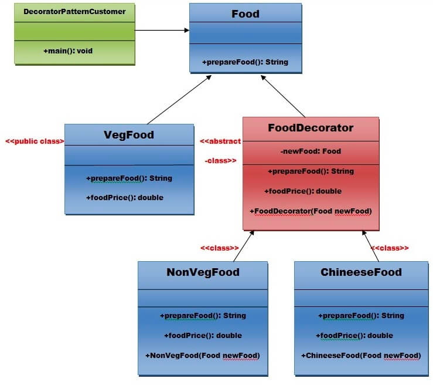

# **Structural Pattern - Decorator**

#### Decorator pattern allows a user to add new functionality to an existing object without altering its structure. 

#### This pattern creates a decorator class which wraps the original class and provides additional functionality keeping class methods signature intact.

#### Advantage of Decorator Pattern
* It provides greater flexibility than static inheritance.
* It enhances the extensibility of the object, because changes are made by coding new classes.
* It simplifies the coding by allowing you to develop a series of functionality from targeted classes instead of coding all of the behavior into the object.

UML 

