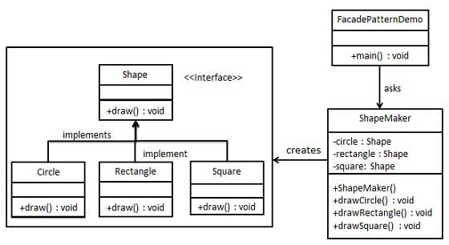

# **Structural design patterns - Facade**

When we have to hide the system complexity from the client.

Facade pattern adds an interface to an existing system to hide its complexities.

This pattern involves a single class which provides simplified methods required by client and delegates calls to methods of existing system classes.

UML 

