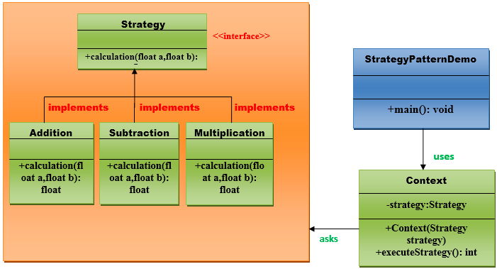

# **Behavioral Pattern - Strategy**

#### A Strategy Pattern says that "defines a family of functionality, encapsulate each one, and make them interchangeable".

#### The Strategy Pattern is also known as Policy.

### Benefits:

* It provides a substitute to subclassing.
* It defines each behavior within its own class, eliminating the need for conditional statements.
* It makes it easier to extend and incorporate new behavior without changing the application.

### Usage:

* When the multiple classes differ only in their behaviors.
* It is used when you need different variations of an algorithm.

### UML

